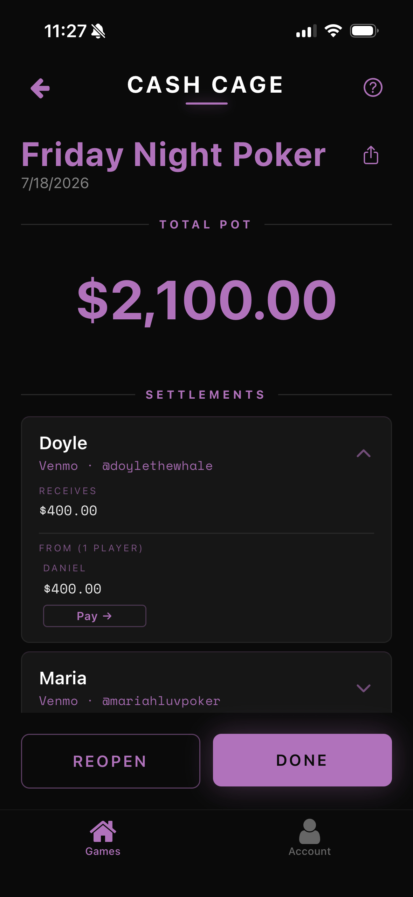
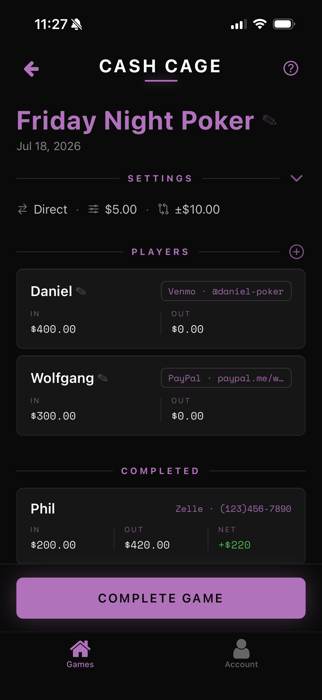
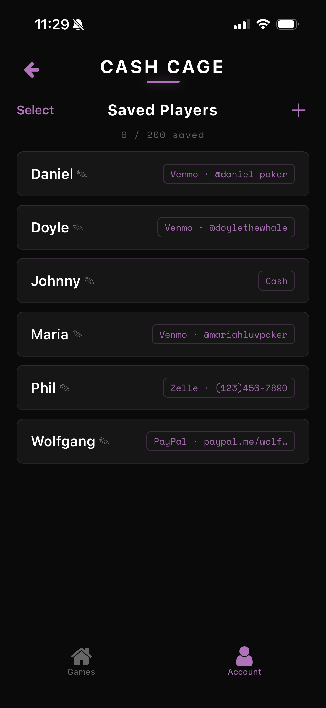
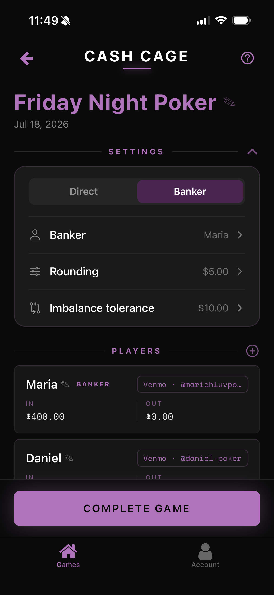
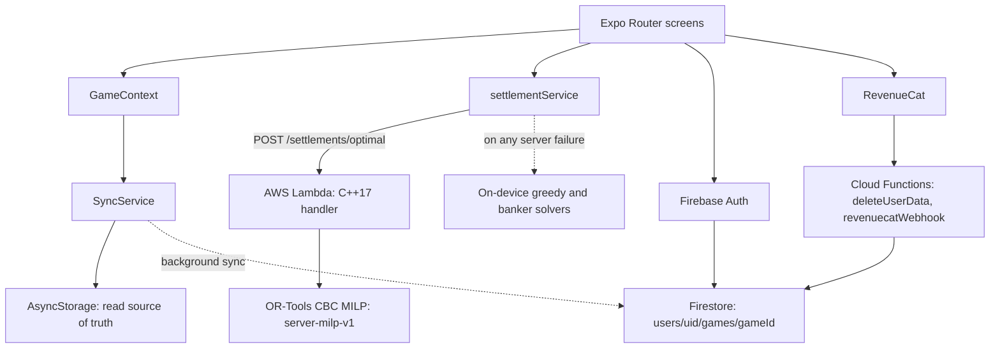

# Cash Cage

Poker buy-in and cash-out tracking that works out who pays whom at the end of the
night. [Download on the App Store](https://apps.apple.com/us/app/cash-cage/id6759301097)

  
  
  
  

## The settlement engine

| Algorithm ID | Where it runs | What it does |
| --- | --- | --- |
| `server-milp-v1` | AWS Lambda, C++ | Minimises the transfer count with a MILP |
| `client-greedy-v1` | On device, TypeScript | Sorted greedy two-pointer fallback |
| `client-banker-v1` | On device, TypeScript | Banker mode for when a designated player pays out everyone |

### `server-milp-v1`

`POST /settlements/optimal` takes the per-player balances and runs three stages
in `backend/src/solvers/milp_solver.cpp`:

1. **Imbalance handling.** The solver sums
   the debts and the credits, and if the gap is within the request's
   `imbalanceTolerance` it is redistributed across the players in proportion to
   the size of their positions and a warning is attached to the response. If the
   gap exceeds the tolerance the request is **rejected**, the response carries a
   warning and *no settlements at all*.
2. **Cash rounding.** Balances are rounded to the game's `cashRoundingUnit` so the
   payouts come out in whole bills, with the biggest winner absorbing the rounding
   residue. A unit of `0` means "Exact" and skips this stage entirely, giving
   cent-precise transfers.
3. **MILP.** For every debtor–creditor pair the model carries a continuous amount
   variable `x` and a binary indicator `y`, linked by a big-M constraint. Each
   debtor must pay out exactly their debt, each creditor must receive exactly
   their credit, and the objective minimises the sum of the `y` indicators.
   Solved with CBC through Google OR-Tools.

Four optional request parameters tune the run. Note that only two of them are
actually MILP constraints; the other two act before the model is ever built:

| Parameter | Kind | Effect |
| --- | --- | --- |
| `maxTransfersPerPlayer` | MILP constraint | Caps how many payments any one debtor sends or any one creditor receives |
| `minTransferAmount` | MILP constraint | Forbids trivially small payments. Any transfer that happens must clear this floor |
| `cashRoundingUnit` | Pre-solve transform | Rounds balances to a bill increment before solving |
| `imbalanceTolerance` | Pre-solve gate | Accept-and-redistribute below the threshold, reject above it |

Two caveats on "fewest transfers". First, the MILP minimises the transfer count
*for the balances it is handed* — stages 1 and 2 both modify those balances before
the model sees them, so the claim is about the post-adjustment table, not about the
raw numbers you typed in. Second, the solver accepts a *feasible* solution as well
as a proven-optimal one, and labels both `server-milp-v1`; if CBC returns a valid
solution without proving optimality, that result is what you get.

### Falling back to the client

`getSettlements` in `frontend/services/settlementService.ts` is server-first with
a 10s default timeout, and it falls back to the on-device greedy solver on *any*
failure. Concretely, the client returns `client-greedy-v1` when:

- `EXPO_PUBLIC_API_BASE_URL` is unset, so no endpoint can be resolved at all
- the caller passed `forceLocal`, or the balance list is empty
- the request aborts on the timeout
- the response status is not OK
- the payload's `settlements` field is missing, is not an array, or is empty —
  **this is the path an out-of-tolerance table takes**, because a rejecting server
  returns a well-formed 200 with an empty settlements array
- every entry in the returned array fails validation, leaving nothing usable

### Banker mode

Banker mode is a different settlement shape, not an optimisation of the same one.
When buy-ins are handed to a banker who holds the pot, losers are never chased at
the end as their money is already in. So the banker simply pays each remaining
player their full cash-out, and the result is labelled `client-banker-v1`. It is
computed on-device only and never touches the solver.

## Architecture

The settlement service is stateless and holds no game data — it receives a list of
balances and returns a list of transfers. Everything durable lives in Firestore
under the signed-in user, mirrored locally on the device.

One `CMakeLists.txt` builds two binaries: `cashcage-backend`, a Crow HTTP server,
and `cashcage-lambda`, an AWS Lambda runtime handler. The Lambda target is gated
behind a `BUILD_LAMBDA` option that defaults to `ON`, so a stock configure gets
both. What they share is the
**solver** — that is the only file in `COMMON_SOURCES`. Each entry point carries
its own route layer, one returning Crow responses and one returning a
framework-agnostic struct that the Lambda runtime adapts. So: one shared solver,
two independently maintained route layers, exposing the same three paths:

| Route | Purpose |
| --- | --- |
| `POST /settlements/optimal` | Solve a table |
| `GET /health` | Liveness probe |
| `GET /` | Service manifest — name, version, endpoint list |

## Offline-first sync

A poker game happens wherever people are sitting, which is frequently somewhere
with bad signal. The app is built so that nothing ever blocks on the network.

**AsyncStorage is the read source of truth.** `SyncService.loadGames` returns the
local copy immediately, then fires a Firestore fetch in the background and hands
the merged result back through a callback. Writes go to AsyncStorage first and to
Firestore fire-and-forget; a failed remote write is logged, never surfaced as an
error, and never blocks the local operation.

**Games merge by last-write-wins on `syncedAt`,** falling back to `createdAt` for
games that have never reached Firestore. A game present in only one source is kept
unconditionally.

Two mechanisms keep that merge from eating live edits:

- **A ref-counted pending-mutations registry.** A game with an unconfirmed local
  write keeps its local version regardless of timestamps, because the in-flight
  remote copy is by definition stale for it; a game with an unconfirmed local
  delete stays deleted even if the merge re-added it from remote. The counts are
  ref-counted rather than a plain set so that under rapid successive edits, the
  first write's confirmation cannot drop protection while a later write is still
  in flight.
- **A storage lock.** AsyncStorage has no transactions, so a user-driven save and
  a background merge can interleave across `await` points and clobber each other.
  All read-modify-write sequences are serialised through a promise chain, in
  submission order, with rejected operations isolated so they cannot deadlock it.

**Saved players are a separate path.** The autocomplete pool of previously used
player names lives in a single Firestore document at
`/users/{uid}/savedPlayers/list`, and it merges as a *union* rather than
last-write-wins. A union merge alone would resurrect any name you deleted, so that
document also carries deletion **tombstones** that let a delete survive the merge.
Tombstones exist only for saved players — games do not use them.

## Tech stack

Versions below are the ones actually declared in this repository.

**App** — `frontend/`

| | |
| --- | --- |
| React Native | 0.83.2 |
| Expo SDK | ~55.0.8 |
| Expo Router | ~55.0.7 |
| React | 19.2.0 |
| TypeScript | ~5.9.3 |
| Firebase JS SDK | ^12.11.0 |
| RevenueCat | react-native-purchases ^9.14.0 |
| Local storage | @react-native-async-storage/async-storage 2.2.0 |
| Animation | react-native-reanimated 4.2.1 |
| Tests | Jest ~29.7.0 with jest-expo ^55.0.11 |

The shipping app version is **2.0.0** and the bundle identifier is
`com.heagenb03.CashCage` on both platforms. The New Architecture and Expo Router
typed routes are both enabled.

**Settlement service** — `backend/`

| | |
| --- | --- |
| Language | C++17 |
| Solver | Google OR-Tools, CBC backend |
| HTTP | Crow v1.2.0 |
| JSON | nlohmann/json v3.11.3 |
| Serverless | aws-lambda-cpp v0.2.8 |
| Build | CMake 3.16+ |

Crow and nlohmann/json are always fetched at the pinned tags above. OR-Tools is
resolved with a plain `find_package` and is deliberately not pinned to a version
in the build file. aws-lambda-cpp sits between the two: the build prefers an
already-installed copy and only falls back to fetching the pinned `v0.2.8` when
`find_package` does not find one, so the version you get depends on your machine.

**Cloud Functions** — `functions/`

TypeScript on the Firebase Functions v2 API: `deleteUserData`, a callable that
recursively removes a user's Firestore data, and `revenuecatWebhook`, an HTTP
endpoint for subscription lifecycle events.

## Repo layout

| Path | Contents |
| --- | --- |
| `frontend/` | The Expo app — screens under `app/`, plus `components/`, `contexts/`, `services/`, `hooks/`, `utils/`, `constants/`, `types/` |
| `backend/` | The C++ settlement service — `src/solvers/` holds the MILP, `src/handlers/` the routing, `src/models/` the shared structs |
| `functions/` | Firebase Cloud Functions |
| `legal/` | Git submodule holding the published legal and landing pages |
| `tools/` | Store and launch assets, including the screenshots at the top of this file |
| `firestore.rules`, `firebase.json`, `.firebaserc` | Firebase project configuration and security rules |

## License

Licensed under the [PolyForm Perimeter License 1.0.1](LICENSE).

You may use, modify, and share this code subject to those terms. You may **not**
use it to provide a product that competes with Cash Cage.

Third-party dependency attributions are in [THIRD-PARTY-NOTICES.md](THIRD-PARTY-NOTICES.md).

Copyright 2026 Heagen Bell.
